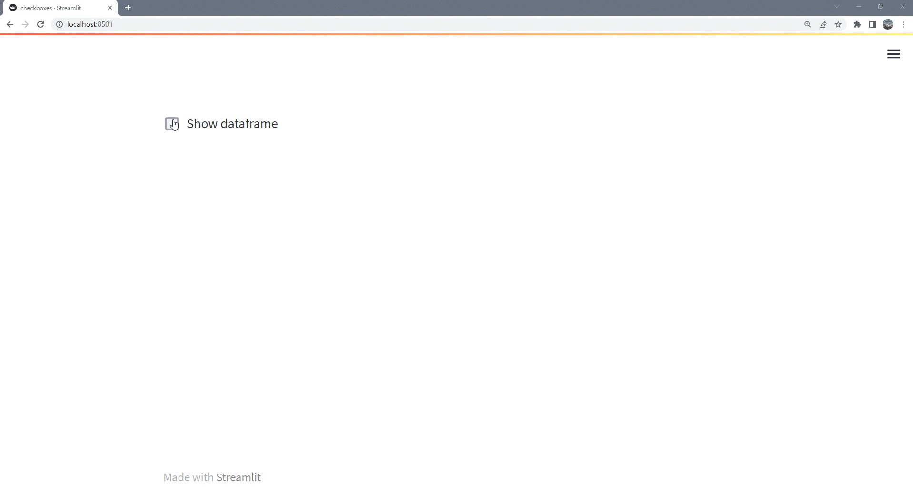

# Create an app

如果你已经走到了这一步，那么你有可能已经[安装](https://docs.streamlit.io/library/get-started/installation)了Streamlit，并在我们的[主要概念](https://docs.streamlit.io/library/get-started/main-concepts)指南中学习了基础知识。如果没有，现在是看一看的好时机。

学习如何使用Streamlit的最简单的方法是自己去尝试。当你阅读本指南时，测试每个方法。只要你的应用程序在运行，每当你在脚本中添加一个新元素并保存时，Streamlit的用户界面就会询问你是否愿意重新运行应用程序并查看变化。这使得你可以在一个快速的交互式循环中工作：你写一些代码，保存它，查看输出，再写一些，如此反复，直到你对结果感到满意。我们的目标是使用Streamlit为你的数据或模型创建一个交互式应用，并在此过程中使用Streamlit来审查、调试、完善和分享你的代码。

在本指南中，你将使用Streamlit的核心功能来创建一个交互式应用程序；探索Uber在纽约市的公共数据集的接送服务。当你完成后，你将知道如何获取和缓存数据，绘制图表，在地图上绘制信息，并使用交互式部件，如滑块，来对结果进行过滤。

> **提示**
> 如果您想跳过并立即查看所有内容，下面提供了完整的脚本。

## 创建第一个应用程序

Streamlit不仅仅是一种制作数据应用程序的方式，它还是一个由创作者组成的社区，他们分享自己的应用和想法，并互相帮助，使自己的作品变得更好。请到社区论坛上加入我们。我们喜欢听你的问题和想法，并帮助你解决程序中的错误——今天就加入吧!

1. 首先，创建一个新的Python脚本。我们称作```uber_pickups.py```。

2. 在你喜欢的IDE或文本编辑器中打开```uber_pickups.py```，然后添加这些代码：

```python
import streamlit as st
import pandas as pd
import numpy as np
```

3. 每个好的应用程序都有一个标题，所以让我们添加一个：

```python
st.title('Uber pickups in NYC')
```

4. 现在是时候从命令行运行Streamlit了：

```python
streamlit run uber_pickups.py
```

运行Streamlit应用程序与其他的Python脚本没有什么不同。每当你需要查看应用程序时，你可以使用这个命令。

> **提示**
> 你知道你也可以向streamlit运行传递一个URL吗？这在与GitHub Gists结合时非常好用。比如说：
>
> ```python
> streamlit run uber_pickups.py
> ```

5. 像往常一样，该应用程序会自动在你的浏览器中打开一个新标签。

## 获取一些数据

现在你有了一个应用程序，你需要做的下一件事是获取Uber在纽约市的接送数据集。

1. 让我们先写一个函数来加载数据。将这段代码添加到你的脚本中：

```python
DATE_COLUMN = 'date/time'
DATA_URL = ('https://s3-us-west-2.amazonaws.com/'
         'streamlit-demo-data/uber-raw-data-sep14.csv.gz')

def load_data(nrows):
    data = pd.read_csv(DATA_URL, nrows=nrows)
    lowercase = lambda x: str(x).lower()
    data.rename(lowercase, axis='columns', inplace=True)
    data[DATE_COLUMN] = pd.to_datetime(data[DATE_COLUMN])
    return data
```

你会注意到```load_data```是一个普通的函数，它下载了一些数据，把它放在一个Pandas数据框架中，并把日期列从text转换为datetime。该函数接受一个参数（```nrows```），它指定了你想加载到数据框架中的行数。

2. 现在让我们测试一下这个函数并查看输出。在你的函数下面，添加这些行：

```python
# Create a text element and let the reader know the data is loading.
data_load_state = st.text('Loading data...')
# Load 10,000 rows of data into the dataframe.
data = load_data(10000)
# Notify the reader that the data was successfully loaded.
data_load_state.text('Loading data...done!')
```

你会在你的应用程序的右上角看到几个按钮，询问你是否愿意重新运行该应用程序。选择**总是重新运行**，你就会在每次保存时自动看到你的变化。

好吧，这太令人沮丧了...

事实证明，下载数据，并将10,000行加载到一个数据框架中需要很长的时间。将日期列转换为datetime也不是一件能够迅速完成的工作。你不希望每次应用更新时都要重新加载数据——幸运的是，Streamlit允许你缓存数据。

## 易用的缓存

1. 试着在```load_data```声明前加入```@st.cache_data```：

```python
@st.cache_data
def load_data(nrows):
```

2. 然后保存脚本，Streamlit会自动重新运行你的应用程序。由于这是你第一次运行带有```@st.cache_data```的脚本，你不会看到任何变化。让我们再调整一下你的文件，以便你能看到缓存的力量。  

3. 把```data_load_state.text('Loading data...done!')```这一行替换成这样：

```python
data_load_state.text("Done! (using st.cache_data)")
```

4. 现在保存。看到你添加的那一行是如何立即出现的吗？如果你退后一步，这实际上是相当惊人的。一些神奇的事情正在幕后发生，而且只需要一行代码就可以激活它。

### 它是如何工作的?

让我们花几分钟时间来讨论一下```@st.cache_data```的实际工作原理。

当你用Streamlit的缓存注解标记一个函数时，它告诉Streamlit，每当函数被调用时，它应该检查两件事：

1. 你用于函数调用的输入参数。
2. 函数中的代码。

如果这是Streamlit第一次看到这两样东西，而且是以这种确切的值，以这种确切的组合，它就会运行这个函数并将结果存储在本地缓存中。下次调用该函数时，如果这两个值没有变化，那么Streamlit知道它可以完全跳过执行该函数。相反，它从本地缓存中读取输出，并将其传递给调用者——就像魔术一样。

"但是，等一下，"你会对自己说，"这听起来好得不象是真的。所有这些神奇的东西有什么限制？"

嗯，有一些：

1. Streamlit只检查当前工作目录下的变化。如果你升级了一个Python库，Streamlit的缓存只会在该库安装在你的工作目录内时才会注意到这一点。
2. 如果你的函数不是确定性的（也就是说，它的输出取决于随机数），或者它从外部时间变化的源头拉取数据（例如，一个实时的股票市场行情服务），那么缓存的值将是不明智的。
3. 最后，你应该避免改变用```st.cache_data```缓存的函数的输出，因为缓存的值是通过引用存储的。

虽然这些限制很重要，但在很多时候，它们往往不是一个问题。那些时候，这个缓存确实是变革性的。

>**提示**
>每当你的代码中有一个长期运行的计算时，如果可能的话，考虑重构它，以便你可以使用```@st.cache_data```。请阅读[Caching](https://docs.streamlit.io/library/advanced-features/caching)以了解更多细节。

现在你知道了Streamlit的缓存是如何工作的，让我们回到Uber pickup数据上。

## 检查原始数据

在你开始工作之前，看一看你所处理的原始数据总是一个好主意。让我们在应用程序中添加一个副标题和原始数据的打印输出：

```python
st.subheader('Raw data')
st.write(data)
```

在[主要概念指南](https://docs.streamlit.io/library/get-started/main-concepts)中，你了解到[st.write](https://docs.streamlit.io/library/api-reference/write-magic/st.write)会渲染你传递给它的几乎任何东西。在本例中，你传入的是一个数据框架，它被渲染成一个交互式表格。

[st.write](https://docs.streamlit.io/library/api-reference/write-magic/st.write)试图根据输入的数据类型来做正确的事情。如果它没有做你期望的事情，你可以使用一个专门的命令，如[st.dataframe](https://docs.streamlit.io/library/api-reference/data/st.dataframe)来代替。完整的列表请见[API参考](https://docs.streamlit.io/library/api-reference)。

## 绘制直方图

现在你已经有机会看一看数据集，观察一下有哪些东西，让我们更进一步，画一个直方图，看看Uber在纽约市最繁忙的时间是什么。

1. 首先，让我们在原始数据部分下面添加一个副标题：

```python
st.subheader('Number of pickups by hour')
```

2. 使用NumPy生成一个直方图，将接客时间按小时进行分类：

```python
hist_values = np.histogram(
    data[DATE_COLUMN].dt.hour, bins=24, range=(0,24))[0]
```

3. 现在，让我们使用Streamlit的[st.bar_chart()](https://docs.streamlit.io/library/api-reference/charts/st.bar_chart)方法来绘制这个直方图。

```python
st.bar_chart(hist_values)
```

4. 保存你的脚本。这个直方图应该马上显示在你的应用程序中。经过快速审查，看起来最繁忙的时间是17:00（下午5点）。

为了绘制这个图表，我们使用了Streamlit的本地```bar_chart()```方法，但重要的是，Streamlit支持更复杂的图表库，如Altair、Bokeh、Plotly、Matplotlib等。完整的列表请见[支持的图表库](https://docs.streamlit.io/library/api-reference/charts)。

## 在地图上绘制数据

使用Uber的数据集的直方图帮助我们确定什么是最繁忙的接客时间，但如果我们想弄清楚整个城市的接客集中在哪里呢。虽然你可以用柱状图来显示这个数据，但除非你对城市的经纬度坐标非常熟悉，否则它不容易解释。为了显示拾取的集中度，让我们使用Streamlit的[st.map](https://docs.streamlit.io/library/api-reference/charts/st.map)函数将数据叠加到纽约市的地图上。

1. 为该部分添加一个小标题：

```python  
st.subheader('Map of all pickups')
```

2. 使用```st.map()```函数来绘制数据：

```python
st.map(data)
```

3. 保存你的脚本。该地图是完全互动的。通过平移或放大一点来试试。

画完直方图后，你确定Uber接客最繁忙的时间是17点。让我们重新绘制地图，以显示17:00的集中接客情况。

1. 找到以下代码段：

```python
st.subheader('Map of all pickups')
st.map(data)
```

2. 将其替换为：

```python
hour_to_filter = 17
filtered_data = data[data[DATE_COLUMN].dt.hour == hour_to_filter]
st.subheader(f'Map of all pickups at {hour_to_filter}:00')
st.map(filtered_data)
```

3. 你应该看到数据立即更新。

为了绘制这张地图，我们使用了Streamlit内置的[st.map](https://docs.streamlit.io/library/api-reference/charts/st.map)函数，但如果你想把复杂的地图数据可视化，我们鼓励你看一下[st.pydeck_chart](https://docs.streamlit.io/library/api-reference/charts/st.pydeck_chart)。

## 用滑块过滤结果

在上一节中，当你绘制地图时，用于过滤结果的时间被硬编码到脚本中，但如果我们想让读者实时动态地过滤数据呢？使用Streamlit的小工具，你可以做到。让我们用```st.slider()```方法在应用程序中添加一个滑块。

1. 找到```hour_to_filter```，用这个代码段替换它：

```python
hour_to_filter = st.slider('hour', 0, 23, 17)  # min: 0h, max: 23h, default: 17h
```

2. 使用滑块并实时观看地图更新。

## 使用按钮切换数据

滑块只是动态更改应用程序组成的一种方法。让我们使用[st.checkbox](https://docs.streamlit.io/library/api-reference/widgets/st.checkbox)功能为您的应用程序添加一个复选框。我们将使用此复选框来显示/隐藏应用程序顶部的原始数据表。

1. 找到这些行：

```python
st.subheader('Raw data')
st.write(data)
```

2.将这些行替换为以下代码：

```python
if st.checkbox('Show raw data'):
    st.subheader('Raw data')
    st.write(data)
```

我们确信你有自己的想法。完成本教程后，请查看Streamlit在我们的[API参考](https://docs.streamlit.io/library/api-reference)中公开的所有小部件。

## 让我们把它们放在一起

就是这样，你已经来到了最后的部分。这是我们交互式应用程序的完整脚本。

>**提示**
>如果您已经跳过，在创建脚本后，运行Streamlit的命令是```Streamlit run[app name]```。

```python
import streamlit as st
import pandas as pd
import numpy as np

st.title('Uber pickups in NYC')

DATE_COLUMN = 'date/time'
DATA_URL = ('https://s3-us-west-2.amazonaws.com/'
            'streamlit-demo-data/uber-raw-data-sep14.csv.gz')

@st.cache_data
def load_data(nrows):
    data = pd.read_csv(DATA_URL, nrows=nrows)
    lowercase = lambda x: str(x).lower()
    data.rename(lowercase, axis='columns', inplace=True)
    data[DATE_COLUMN] = pd.to_datetime(data[DATE_COLUMN])
    return data

data_load_state = st.text('Loading data...')
data = load_data(10000)
data_load_state.text("Done! (using st.cache_data)")

if st.checkbox('Show raw data'):
    st.subheader('Raw data')
    st.write(data)

st.subheader('Number of pickups by hour')
hist_values = np.histogram(data[DATE_COLUMN].dt.hour, bins=24, range=(0,24))[0]
st.bar_chart(hist_values)

# Some number in the range 0-23
hour_to_filter = st.slider('hour', 0, 23, 17)
filtered_data = data[data[DATE_COLUMN].dt.hour == hour_to_filter]

st.subheader('Map of all pickups at %s:00' % hour_to_filter)
st.map(filtered_data)
```


## 分享你的应用

在您构建了Streamlight应用程序之后，是时候分享它了！为了向世界展示它，您可以使用**Streamlit社区云**免费部署、管理和共享您的应用程序。
它分为3个简单步骤：

1. 将你的应用程序放在公共GitHub repo中（并确保它有requirements.txt！）
2. 登录[share.streamlit.io](https://share.streamlit.io/)
3. 单击“部署应用程序”，然后粘贴到您的GitHub URL中
   就是这样！🎈 您现在有了一个公开部署的应用程序，可以与世界共享。单击以了解有关[如何使用Streamlight社区云](https://docs.streamlit.io/streamlit-community-cloud)的更多信息。

## 获得帮助

就这样开始吧，现在你可以开始构建自己的应用了！如果你遇到困难，这里有几件事你可以做。

* 查看我们的[社区论坛](https://discuss.streamlit.io/)并发布问题
* 使用```streamlit help```从命令行获得快速帮助
* 浏览我们的[知识库](https://docs.streamlit.io/knowledge-base)，了解有关创建和部署Streamlight应用程序的提示、分步教程和文章。
* 阅读更多文档！查看：
  * 缓存、主题化和为应用程序添加状态等[高级功能](https://docs.streamlit.io/library/advanced-features)。
  * 每个Streamlit命令示例的[API参考](https://docs.streamlit.io/library/api-reference)。
